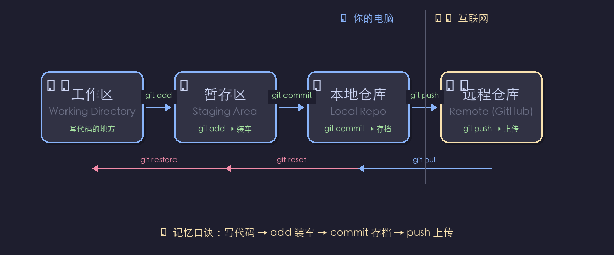

# AI 学生需要学 Git 吗？

## 一句话结论

**必须会。代码版本管理是 AI 学生的基本功，Git 是行业标准。**

Git 不是可选项——交作业、复现论文、团队协作，全都靠它。

---

## Git 学习内容全景图

### 🟢 生存级（必学，~8 个）—— 不会代码都交不上去

| 操作 | 命令 | 什么时候用 |
|------|------|-----------|
| 克隆仓库 | `git clone <url>` | 把别人的代码拉到本地 |
| 查看状态 | `git status` | "我现在改了什么？" |
| 添加暂存 | `git add <file>` | 告诉 Git 哪些改动要提交 |
| 提交记录 | `git commit -m "说明"` | 保存一个版本快照 |
| 推送到远程 | `git push` | 把本地代码上传到 GitHub |
| 拉取更新 | `git pull` | 把远程的新代码同步下来 |
| 切换分支 | `git checkout <分支>` | 换到另一个分支 |
| 查看日志 | `git log` | 看提交历史 |

```bash
# 日常最基本操作就是这几步：
git add .                          # 暂存所有改动
git commit -m "修了loss计算的bug"    # 提交到本地
git push                           # 推到GitHub
```

### 🟡 效率级（该学，~6 个）—— 协作和处理意外

| 操作 | 命令 | 什么时候用 |
|------|------|-----------|
| 创建/切换分支 | `git checkout -b <分支名>` | 开新功能，不搞坏主分支 |
| 合并分支 | `git merge <分支>` | 功能写好了，合回主分支 |
| 查看差异 | `git diff` | "我到底改了啥？" |
| 撤销修改 | `git restore` / `git reset` | "改坏了，回到上一个版本" |
| 储藏暂存 | `git stash` | "临时切走，手头的东西先存起来" |
| 查看远程 | `git remote -v` | 看连接的远程仓库地址 |

### 🔵 进阶级（选学，~5 个）—— 团队骨干才用到

| 操作 | 命令 |
|------|------|
| 变基 | `git rebase` |
| 挑选提交 | `git cherry-pick` |
| 交互式变基 | `git rebase -i`（整理提交历史） |
| 二分查找bug | `git bisect` |
| 打标签 | `git tag`（标记版本，如 v1.0） |

```
生存级  8 个  ← 单人做项目必须会
效率级  6 个  ← 多人协作就要会
进阶级  5 个  ← 团队骨干才用到
────────────────
总计约 19 个操作/概念
```

---

## Git vs Shell 对比

| | Shell | Git |
|------|-------|-----|
| 总量 | ~35 个 | ~19 个 |
| 生存级 | 15 个 | 8 个 |
| 学习难度 | 命令多但散 | 命令少但概念绕 |
| 核心难点 | 记命令 | 理解工作区/暂存区/仓库 |

> Git 命令比 Shell 少一半，但理解"版本"这个概念需要花点功夫。Shell 是你和计算机对话，Git 是你和时间轴上的代码对话。

---

## ⭐ Git 的核心概念：三个区

> 🔥 **这是整个 Git 最重要的概念。理解这四层关系，Git 就懂一半了。**

```
工作区 (Working Directory)    →  暂存区 (Staging Area)  →  本地仓库 (Local Repo)  →  远程仓库 (Remote)
    你写代码的地方              git add 收集到这里        git commit 正式存档       git push 上传
```

| 区域 | 对应操作 |
|------|---------|
| 工作区 | 写代码、改文件 |
| 暂存区 | `git add` → 挑选改动，放进购物车 |
| 本地仓库 | `git commit` → 结账，生成版本快照 |
| 远程仓库 | `git push` → 上传到 GitHub / GitLab |



> 🧠 **记忆口诀**：写代码 → `add` 装车 → `commit` 存档 → `push` 上传。回头路：`restore` 撤销修改，`reset` 撤销暂存。

---

## 建议学习顺序

| 天数 | 内容 |
|------|------|
| 第 1 天 | `clone` + `add` + `commit` + `push` + `pull` 跑通一轮 |
| 第 2 天 | `branch` + `checkout` + `merge`（理解分支） |
| 第 3 天 | `diff` + `log` + `status`（学会"看"比"改"更重要） |
| 之后 | 碰到问题再学对应的命令 |

> 一周掌握生存级 8 个，够你做项目、交作业、复现代码了。

---

## 📖 命令速查

> 学一个记一个，慢慢攒。

### `git init` — 初始化一个新仓库

```bash
git init                 # 在当前目录创建 .git 文件夹，开始版本管理
git init my-project      # 新建目录并初始化
```

### `git clone` — 克隆远程仓库到本地

```bash
git clone https://github.com/user/repo.git    # HTTPS 方式
git clone git@github.com:user/repo.git        # SSH 方式
```

### `git status` — 查看当前状态

```bash
git status               # 哪些文件改了？哪些还没 add？哪些还没 commit？
```

### `git add` — 将改动添加到暂存区

```bash
git add file.py          # 添加单个文件
git add .                # 添加当前目录所有改动（最常用）
git add -A               # 添加所有改动（包括删除的文件）
```

### `git commit` — 提交到本地仓库

```bash
git commit -m "修了loss计算的bug"         # -m = message，提交说明
git commit -am "小改动，跳过add"          # 合并 add + commit（仅对已跟踪文件生效）
```

### `git push` — 推送到远程仓库

```bash
git push                        # 推送到默认远程
git push origin main            # 推送到指定远程的指定分支
git push -u origin main         # 首次推送，-u 绑定默认上游
```

### `git pull` — 从远程拉取并合并

```bash
git pull                        # 拉取当前分支的最新代码
git pull origin main            # 从指定远程拉取指定分支
```

### `git branch` — 分支管理

```bash
git branch                      # 列出所有本地分支
git branch dev                  # 创建 dev 分支
git branch -d dev               # 删除 dev 分支
```

### `git checkout` — 切换分支 / 恢复文件

```bash
git checkout dev                # 切换到 dev 分支
git checkout -b dev             # 创建并切换到 dev 分支（-b = branch）
git checkout -- file.py         # 撤销工作区的改动（恢复到最后一次commit的状态）
```

### `git merge` — 合并分支

```bash
git checkout main               # 先切到目标分支
git merge dev                   # 把 dev 分支合并进来
```

> 合并可能有冲突（conflict），需要手动解决——这是 Git 初学者第一个真正的坎。

### `git log` — 查看提交历史

```bash
git log                         # 完整历史
git log --oneline               # 一行一条，简洁模式
git log --oneline -5            # 只看最近 5 条
```

### `git diff` — 查看改动内容

```bash
git diff                        # 工作区 vs 暂存区（还没 add 的改动）
git diff --staged               # 暂存区 vs 最近一次 commit
git diff HEAD                   # 工作区 vs 最近一次 commit（全部未提交的改动）
```
